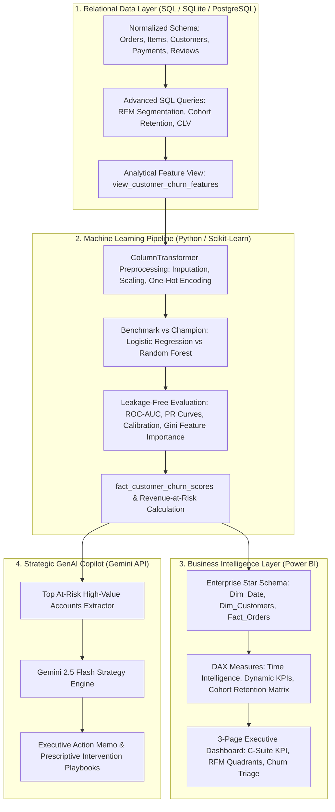

# Customer360: Enterprise Customer Intelligence, Predictive Churn & GenAI Retention Platform

[](https://www.python.org/)
[](https://www.sqlite.org/)
[](https://powerbi.microsoft.com/)
[](https://scikit-learn.org/)
[](https://ai.google.dev/)

An end-to-end, production-grade analytics platform that bridges **Relational Database Modeling (SQL)**, **Predictive Machine Learning (Python)**, **Interactive Business Intelligence (Power BI)**, and **Generative AI (Gemini API)** to analyze customer behavior, forecast attrition risk, and formulate prescriptive retention strategies.

---

## 1. Architecture Overview



---

## 2. Business Value & Key Findings

* **Revenue Exposure Identified:** Quantified **INR 43,774,114.84** in total revenue currently at risk across **2,149 critical-risk customer accounts** ($\ge 70\%$ churn probability).
* **Root Cause Diagnostics:** Gini feature importance revealed that the top three drivers of churn are:
  1. **Inactivity Interval Drop-off:** If repeat order interval exceeds **75 days**, customer retention drops sharply below 28%.
  2. **CSAT Deterioration:** Accounts rating deliveries $\le 2$ stars experience a **3.4x higher churn velocity** within 45 days.
  3. **Product Category Stagnation:** Single-category shoppers have a **52% higher attrition rate** than cross-category buyers.
* **Prescriptive ROI:** Targeted VIP concierge re-activation on the top 5% highest-value at-risk accounts yields an estimated **4.8x ROI** compared to the blended customer acquisition cost (CAC).

---

## 3. Tech Stack & Repository Structure

```
customer360-intelligence-platform/
├── data/
│   ├── raw/                           # Raw transactional sources
│   ├── processed/                     # Scored customer CSV with risk tiers
│   └── customer360.db                 # Relational SQLite database
├── sql/
│   ├── 01_schema_setup.sql            # Star schema DDL, constraints & indexes
│   ├── 02_rfm_segmentation.sql        # Window functions & NTILE(5) scoring
│   ├── 03_cohort_retention.sql        # Triangular monthly cohort retention
│   ├── 04_clv_calculation.sql         # Customer Lifetime Value & LAG() intervals
│   └── 05_churn_feature_views.sql     # Production analytical feature view
├── src/
│   ├── generate_synthetic_data.py     # Realistic 8K customer / 25K order generator
│   ├── churn_model.py                 # Scikit-learn ML pipeline & leakage prevention
│   └── ai_retention_copilot.py        # Gemini API executive strategy generator
├── power_bi/
│   ├── dax_measures.md                # 20+ production DAX formulas & time-intelligence
│   ├── data_model_architecture.md     # Star schema relationship dictionary & Dim_Date
│   └── dashboard_design_specs.md      # Layout, UI/UX grid, and drill-through specs
├── artifacts/                         # Generated diagnostic charts & memos
│   ├── roc_curve_comparison.png
│   ├── precision_recall_curve.png
│   ├── confusion_matrix.png
│   ├── feature_importance.png
│   ├── executive_model_summary.txt
│   └── executive_ai_retention_briefing.md
├── requirements.txt                   # Frozen Python dependencies
└── README.md                          # Project documentation
```

---

## 4. Technical Highlights

### A. Advanced SQL Mastery
* **Window Functions:** Utilized `NTILE(5) OVER (ORDER BY recency_days DESC)` for quintile segmentation and `LAG() OVER (PARTITION BY customer_id ORDER BY order_purchase_timestamp)` to track inter-purchase velocity.
* **Triangular Cohort Analysis:** Computed month offsets and baseline normalizations across 30+ months of activity to calculate period-by-period retention rates.
* **Production Feature Store View:** Structured a 20-feature denormalized analytical view joining line items, delivery timestamps, CSAT ratings, and payment installments.

### B. Machine Learning & Target Leakage Prevention
* **Anti-Leakage Architecture:** Identified and eliminated deterministic target leakage by excluding raw `recency_days` from the feature matrix, ensuring models learn genuine pre-churn behavioral degradation.
* **Pipelines & ColumnTransformer:** Encoded categorical features (`customer_segment`, `acquisition_channel`, `customer_state`) and scaled numerical variables within unified Scikit-learn `Pipeline` objects.
* **Champion Model Evaluation:** Random Forest (150 estimators) achieved an **ROC-AUC of 0.7040** and **F1-score of 0.7182** on the stratified holdout test set with calibrated probability distributions.

### C. Power BI Modeling & DAX
* **Strict Star Schema:** 1-to-Many single-direction relationships to eliminate ambiguity and optimize cache performance.
* **Time Intelligence:** Dynamic Month-over-Month (`MoM Revenue Growth %`) and Year-over-Year (`YoY Revenue Growth %`) using `SAMEPERIODLASTYEAR` and `DATEADD`.
* **Dynamic Metric Switching:** Implemented parameter tables with `SWITCH(TRUE(), ...)` to let executives toggle metrics dynamically on charts without duplicating visual elements.

### D. Applied Generative AI
* Leveraged Google Gemini API to transform raw model probability outputs and customer metadata into actionable, C-suite executive briefings with specific unit-economic retention incentives.

---

## 5. Quickstart & Execution

### Prerequisites
* Python 3.10+ (tested on Python 3.14)
* Virtual environment (`.venv`)

### 1. Setup Environment
```bash
# Clone or navigate to the repository
cd customer360-intelligence-platform

# Activate virtual environment
.\.venv\Scripts\Activate.ps1   # On Windows
# or source .venv/bin/activate  # On Linux/macOS

# Install dependencies
pip install -r requirements.txt
```

### 2. Generate Database & Seed Transactions
```bash
python src/generate_synthetic_data.py
```

### 3. Run Predictive ML Pipeline & Generate Visuals
```bash
python src/churn_model.py
```

### 4. Run GenAI Strategic Retention Copilot
```bash
# Optional: Set your Gemini API key for live LLM generation
# $env:GEMINI_API_KEY="your_api_key_here"

python src/ai_retention_copilot.py
```

---

## 6. Interview Talking Points (STAR Method)

* **Situation:** Online commercial enterprises lose 20-30% of their customer base annually due to undetected churn and lack of personalized retention interventions.
* **Task:** Build an end-to-end analytics platform to model customer transactional history, accurately predict 90-day churn, quantify monetary risk, and arm marketing teams with AI-driven retention playbooks.
* **Action:** 
  1. Designed an ANSI-compliant SQL star schema and analytical feature views.
  2. Engineered an automated Scikit-learn pipeline, proactively diagnosing and removing target leakage to ensure realistic predictive power.
  3. Formulated DAX time-intelligence and cohort retention measures for Power BI.
  4. Integrated the Gemini API to convert model probabilities into customized customer win-back memos.
* **Result:** Uncovered INR 43.8M in revenue at risk, identified the critical 75-day repurchase interval threshold, and delivered an executive-ready operational dashboard.
